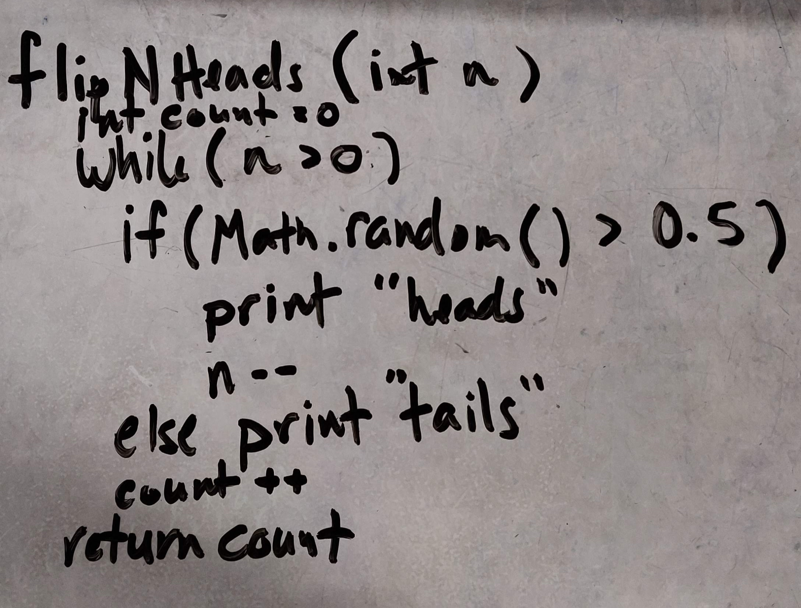
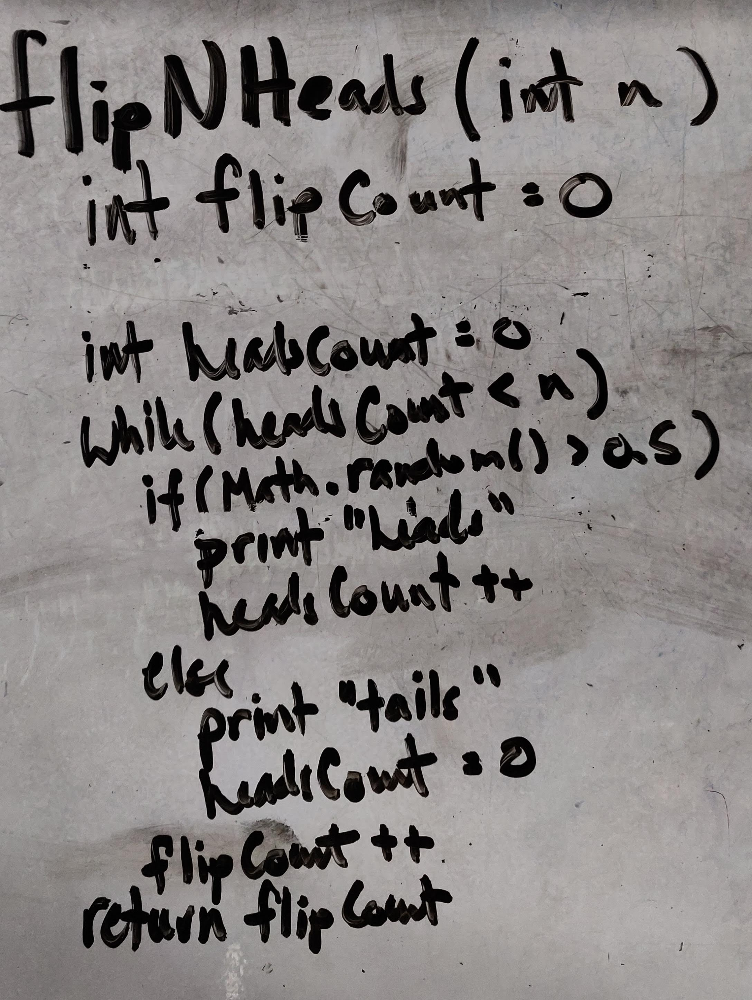

# Java Basics
1. **pluralize**
- Description: method used to pluralize a string if the quantity is greater than 1.
- Input: String to be pluralized, int to determine if the string should be pluralized.
- Output: String

2. **flipNHeads**
- Description: method used to randomly determine the number of times it takes to flip a coin and get a certain number of heads in a row.
- Input: int indicating the number of desired consecutive heads
- Output: String with the result of each flip. Returns int indicating the number of flips to get desired number of consecutive flips.
- Psuedocode Version 1

- Psuedocode Version 2

3. **clock**
- Description: method used to display the time second by second
- Input: none
- Output: String with the current time in HH:mm:ss format and cycles per second in MHz